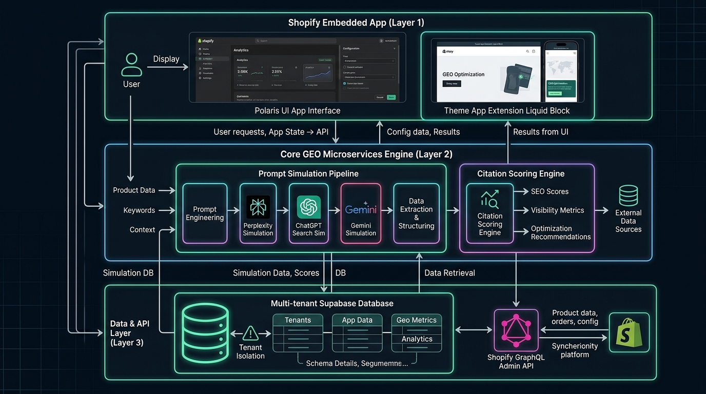

# 🚀 GeoSync: AI Search & ChatGPT SEO for Shopify

[](https://www.typescriptlang.org/)
[](https://shopify.dev/)
[](docs/GEO_ALGORITHM_SPEC.md)

**GeoSync** is the first purpose-built **Generative Engine Optimization (GEO)** platform on the Shopify App Store. It empowers e-commerce merchants to optimize their product catalogs so they get **cited, recommended, and purchased** when buyers search on **ChatGPT Search, Perplexity, Gemini, and Google AI Overviews**.

---

## 🏛️ System Architecture

The codebase is architected as a **decoupled monorepo** to allow rapid Shopify App Store distribution while keeping the core AI engine platform-agnostic for future multi-channel expansion.



### Decoupled 3-Layer Structure
1. **`packages/shopify-app`**: Lightweight Shopify Embedded App (Remix/Node, Polaris UI, App Bridge) + Theme App Extension (Liquid App Blocks injecting into `{{ content_for_header }}`).
2. **`packages/core-engine`**: Framework-agnostic GEO prompt simulation, 0–100 Citation Readiness Scorer, and RAG JSON-LD & FAQ generator.
3. **`packages/shared-types`**: Shared domain models and TypeScript contracts.

---

## 📂 Project Structure

```
shopify_GEO/
├── .antigravity/                   # Antigravity Autonomous Subagents
│   └── agents/
│       ├── gtm-researcher.md       # App Store keyword & competitor watcher
│       ├── synthetic-data-gen.md   # Synthetic catalog & query test fixtures
│       ├── compliance-auditor.md   # Shopify review & GDPR compliance auditor
│       └── architecture-designer.md# System architecture & C4 diagrams
├── docs/                           # Living Technical & Strategy Docs
│   ├── ARCHITECTURE.md             # C4 models, sequence flows, data contracts
│   ├── PRD.md                      # Comprehensive PRD & Critical User Journeys
│   ├── GEO_ALGORITHM_SPEC.md       # AI Citation Readiness & Info Gain formulas
│   ├── GTM_PLAYBOOK.md             # App Store SEO, cold outreach & review flywheel
│   └── COMPLIANCE_AND_LEGAL.md     # Mandatory GDPR webhooks & IP safety guide
├── pm/                             # Agile Project Management Suite
│   ├── ROADMAP.md                  # 4-Week Milestone Roadmap (Zero to Launch)
│   ├── SPRINTS.md                  # Detailed sprint backlog with Acceptance Criteria & DoD
│   ├── TASKS.md                    # Active Kanban task board
│   └── skills/                     # Curated open-source agent PM skills
│       ├── prd-writer.md
│       ├── shape-up-pitch.md
│       ├── acceptance-criteria-bdd.md
│       ├── c4-architecture-designer.md
│       └── competitor-teardown.md
├── packages/
│   ├── core-engine/                # Decoupled GEO Simulation & Scoring Engine
│   ├── shopify-app/                # Polaris Embedded Dashboard & Theme Extension
│   └── shared-types/               # Common TypeScript interfaces
├── package.json                    # Monorepo root configuration
├── tsconfig.base.json              # Shared TypeScript base configuration
└── README.md
```

---

## 🛠️ Quickstart & Development

### 1. Install & Build
```bash
# Build all packages across the monorepo
npm run build

# Run unit tests for Core GEO Engine
npm test
```

### 2. Shopify App Development
```bash
# Start local Shopify dev tunnel connected to your Development Store
npm run dev:shopify
```

---

## 🤖 Antigravity Multi-Agent Workflow

This workspace is designed to be paired with **Google Antigravity** using a dual-track workflow:
* **Track A (Active Coding)**: Develop the core engine, Polaris UI, and GraphQL services.
* **Track B (Background Subagents)**: Delegate long-running tasks to specialized agents configured in `.antigravity/agents/`:
  * `gtm-researcher`: Monitors Shopify App Store keyword rankings and competitor moves.
  * `synthetic-data-gen`: Generates synthetic test fixtures for K-beauty/D2C products and evaluates LLM citation rates.
  * `compliance-auditor`: Verifies that endpoints and Liquid blocks meet Shopify App Store review guidelines.

---

## 📖 Key Documentation Quicklinks
* 📘 [Product Requirements Document (PRD)](docs/PRD.md)
* 📐 [System Architecture & Sequence Flows](docs/ARCHITECTURE.md)
* 🧮 [GEO Algorithm & Scoring Formula](docs/GEO_ALGORITHM_SPEC.md)
* 📈 [Go-to-Market & Review Flywheel Playbook](docs/GTM_PLAYBOOK.md)
* 🔒 [Compliance, GDPR & Legal Readiness](docs/COMPLIANCE_AND_LEGAL.md)
* 🗺️ [4-Week Agile Roadmap](pm/ROADMAP.md) | [Sprint Backlog](pm/SPRINTS.md) | [Active Tasks](pm/TASKS.md)
