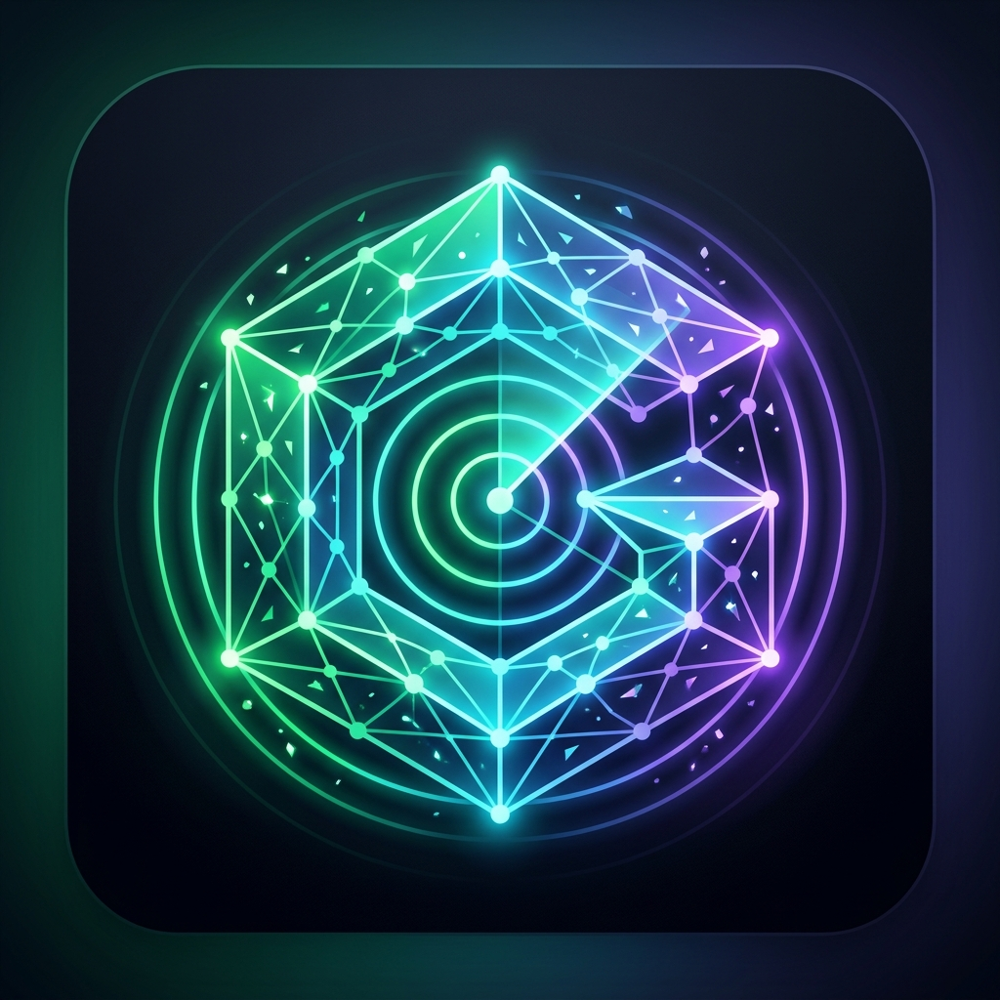
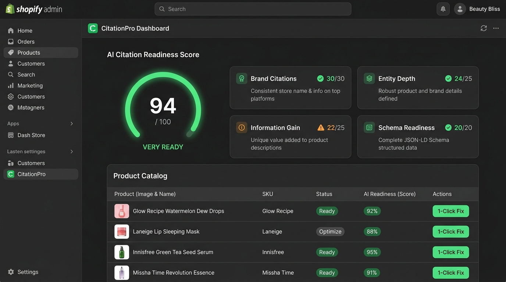
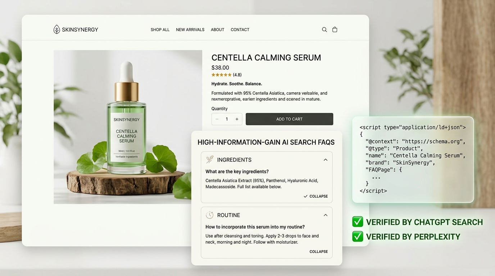

# 🛍️ Official Shopify App Store Listing: AEO Engine (Answer Engine Optimization)

## 1. Listing Metadata

| Field | Content |
|---|---|
| **App Name** | `AEO Engine: ChatGPT & AI Search SEO` |
| **Subtitle (Tagline)** | `Answer Engine Optimization (AEO) & Schema for ChatGPT & Perplexity` |
| **Primary Category** | `Marketing & Conversion` $\rightarrow$ `Search Engine Optimization (SEO)` |
| **Secondary Category** | `Store Management` $\rightarrow$ `Product Data & Feeds` |
| **Pricing** | Free Plan available (5 products). Pro Growth: $39/month (14-day free trial). |

---

## 2. App Icon & Screenshots

### Official App Icon (AEO Neural Radar)


### Desktop Screenshot 1: Polaris AEO Audit Dashboard & 0-100 Scorecard


### Desktop Screenshot 2: Storefront High-Information-Gain FAQ & Verified AEO Schema


---

## 3. Official App Store Listing Description

### Detailed Description (Markdown)

```text
Are you losing high-intent customers as shoppers shift from Google to ChatGPT, Perplexity, and AI Overviews?

Traditional SEO tools only optimize for 2015 Google bot crawlers. They are completely blind to modern Answer Engines (AEO).

AEO Engine is the first purpose-built Answer Engine Optimization (AEO) platform for Shopify. We audit your product catalog across conversational AI engines and automatically inject the structured entity data needed to get your products recommended, cited, and purchased.

✨ KEY FEATURES:

1. AI Search & Answer Engine Simulation
• Simulate realistic buyer search queries across Perplexity, ChatGPT Search, and Gemini.
• Get an instant 0–100 AI Citation Readiness Score for every product in your catalog.
• Identify critical missing entity gaps (active ingredients, clinical claims, return policies, usage routines).

2. 1-Click RAG JSON-LD Schema Injection
• Auto-inject rich nested JSON-LD schema graphs (Product, Offer, ItemAvailability, MerchantReturnPolicy).
• Feeds clean structured entities to GPTBot, PerplexityBot, and Google-Extended.
• Zero theme code editing required—injected safely via official Theme App Extensions.

3. High-Information-Gain FAQ Generator
• Generate high-context Q&A accordions answering the exact comparison questions shoppers ask AI.
• Boost your organic search ranking and conversion rate simultaneously.

4. 100% Theme Safe
• Built strictly with Shopify Theme App Blocks. Your theme code is never modified, guaranteeing zero risk when updating themes.

🚀 Start your 14-day free trial today and make your store AI-Search & AEO Ready!
```

---

## 4. Search Keywords & Meta Tags (Capturing 100% of Search Traffic)
* `AEO (Answer Engine Optimization)`
* `ChatGPT SEO`
* `Perplexity Optimization`
* `AI Search Engine Optimization`
* `Generative Engine Optimization (GEO)`
* `JSON-LD Schema & Rich Snippets`
* `Google AI Overviews`
