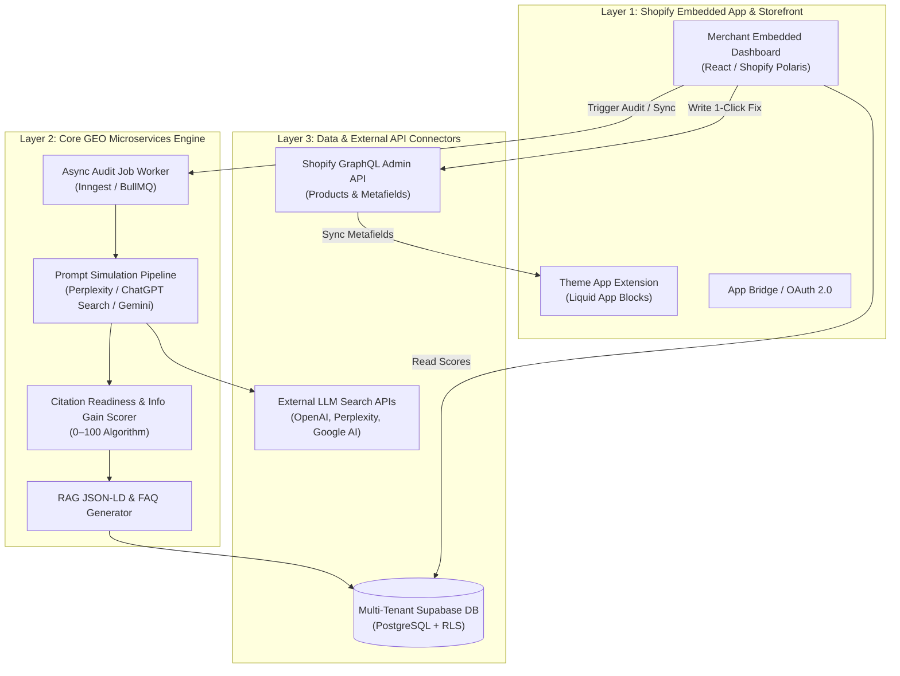
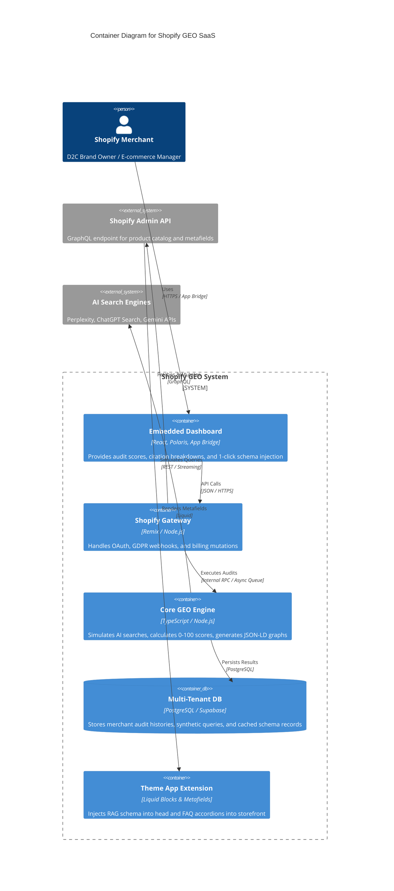
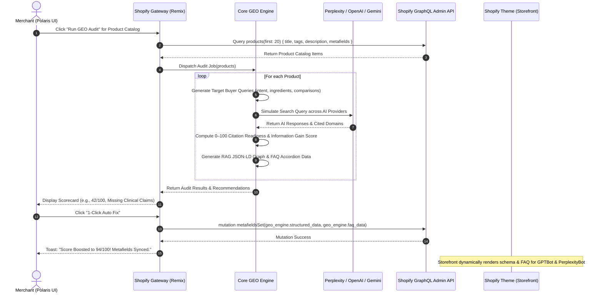

# System Architecture & Technical Design

## 1. High-Level Overview

The **Shopify GEO Platform** is architected as a **decoupled monorepo** to maximize early distribution velocity via the Shopify App Store while preventing platform lock-in.


---

## 2. Decoupled 3-Layer Architecture

The system comprises three cleanly isolated layers:



---

## 3. C4 Model: Container & Component Design

### Container Diagram


---

## 4. End-to-End Sequence Flow: 1-Click GEO Optimization



---

## 5. Multi-Tenant Database Schema (PostgreSQL / Supabase)

```sql
-- Merchants table (Multi-tenant isolation via shop_domain)
CREATE TABLE merchants (
    id UUID PRIMARY KEY DEFAULT gen_random_uuid(),
    shop_domain VARCHAR(255) UNIQUE NOT NULL,
    access_token TEXT NOT NULL,
    plan_tier VARCHAR(50) DEFAULT 'free', -- 'free', 'pro', 'scale'
    installed_at TIMESTAMP WITH TIME ZONE DEFAULT NOW(),
    uninstalled_at TIMESTAMP WITH TIME ZONE
);

-- Product Audit Scores
CREATE TABLE product_audits (
    id UUID PRIMARY KEY DEFAULT gen_random_uuid(),
    merchant_id UUID REFERENCES merchants(id) ON DELETE CASCADE,
    shopify_product_id VARCHAR(255) NOT NULL,
    product_title VARCHAR(500) NOT NULL,
    overall_score INT NOT NULL,
    citation_rate_score INT NOT NULL,
    entity_completeness_score INT NOT NULL,
    info_gain_score INT NOT NULL,
    schema_readiness_score INT NOT NULL,
    missing_entities JSONB DEFAULT '[]'::jsonb,
    competitor_threats JSONB DEFAULT '[]'::jsonb,
    generated_at TIMESTAMP WITH TIME ZONE DEFAULT NOW()
);

-- Simulation Logs
CREATE TABLE simulation_logs (
    id UUID PRIMARY KEY DEFAULT gen_random_uuid(),
    audit_id UUID REFERENCES product_audits(id) ON DELETE CASCADE,
    provider VARCHAR(50) NOT NULL,
    query_text TEXT NOT NULL,
    raw_response TEXT,
    cited_domains JSONB DEFAULT '[]'::jsonb,
    is_brand_cited BOOLEAN DEFAULT FALSE,
    created_at TIMESTAMP WITH TIME ZONE DEFAULT NOW()
);
```

---

## 6. Expansion & Future Multi-Channel Connectors

Because `@shopify-geo/core-engine` is decoupled from Shopify APIs, expanding to other channels (WooCommerce, Amazon Brand Registry, Standalone D2C Web) requires only adding a channel connector:

```
[Core GEO Engine (@shopify-geo/core-engine)]
       │
       ├──► [Shopify Adapter (@shopify-geo/shopify-app)]
       ├──► [Future: WooCommerce REST Adapter]
       ├──► [Future: Amazon A9/Rufus Entity Adapter]
       └──► [Future: Standalone Merchant Web Portal]
```
