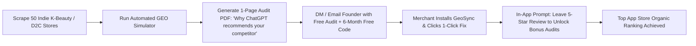

# Go-to-Market (GTM) & Distribution Playbook

## 1. Shopify App Store Optimization (ASO) Strategy

### App Title & Subtitle Concepts
* **App Name**: `GeoSync: AI Search & ChatGPT SEO`
* **Subtitle**: `Get your products recommended by ChatGPT, Perplexity & AI Overviews`

### Target High-Intent Search Queries
* `ChatGPT SEO`
* `AI Search Engine Optimization`
* `Perplexity Optimization`
* `AI Product Schema`
* `JSON-LD Rich Snippets`
* `Generative Engine Optimization (GEO)`

---

## 2. Cold Audit Outbound Playbook (Day-1 Customer Acquisition)

Rather than spending money on paid ads, utilize the **Automated Cold Audit Flywheel**:



### Outbound Email Template (High-Response Cold Script)
```text
Subject: quick AI search audit for {{Brand_Name}} (ChatGPT vs {{Competitor_Brand}})

Hey {{Founder_First_Name}},

I was testing how ChatGPT Search and Perplexity recommend products in the {{Category}} niche.

When asked for "best {{product_type}} for sensitive skin", ChatGPT currently recommends {{Competitor_Brand}} because their product page has structured entity citations, while {{Brand_Name}} isn't getting cited despite your awesome reviews.

I built a free audit showing the 3 missing schema entities you can fix in 1 minute:
[Link to Live Audit Screenshot]

Built an automated Shopify tool that injects the required AI schema with 1 click. Would love to give you a 6-month free VIP license in exchange for your honest feedback!

Best,
{{Your_Name}}
```

---

## 3. Review Flywheel Mechanics

* **Trigger**: After merchant syncs 3 products and boosts score to 90+.
* **Reward**: Free unlock of 20 additional product simulations.
* **Goal**: Reach **15 verified 5-star reviews** within the first 14 days of launch to lock down top-3 App Store organic ranking for `AI SEO` keywords.
